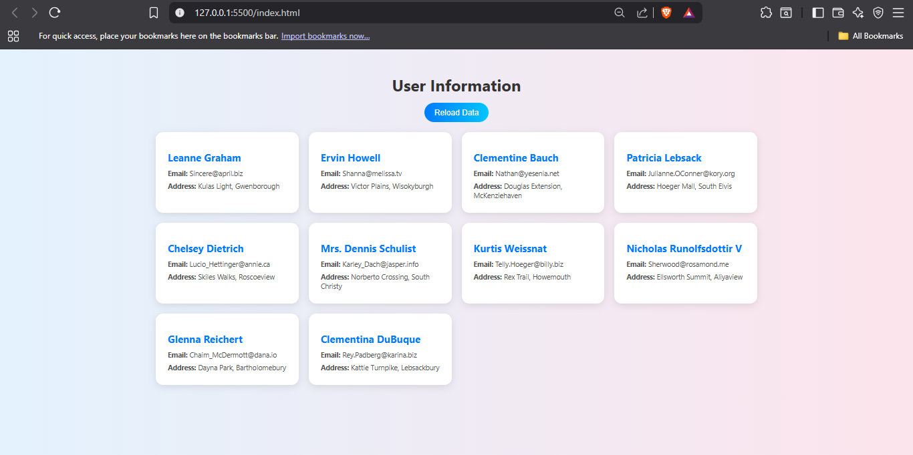

#  Fetch API - User Data Display

A simple JavaScript project that fetches user data from the [JSONPlaceholder API](https://jsonplaceholder.typicode.com/users) and displays it on a modern, responsive webpage with **skeleton loading animation** and error handling.

---

##  Features
- Fetches user name, email, and address** from a public API.
- Skeleton loader animation while data loads.
- Reload button to re-fetch data.
- Responsive grid layout.
- Hover animations for interactive cards.
- Error handling for network or API issues.

---

## 🛠 Technologies Used
- HTML
- CSS3(Modern UI styling + animations)
- JavaScript (Fetch API)

---
## Preview
_

## Author
- Aditi Bhatt - Frontend Developer
